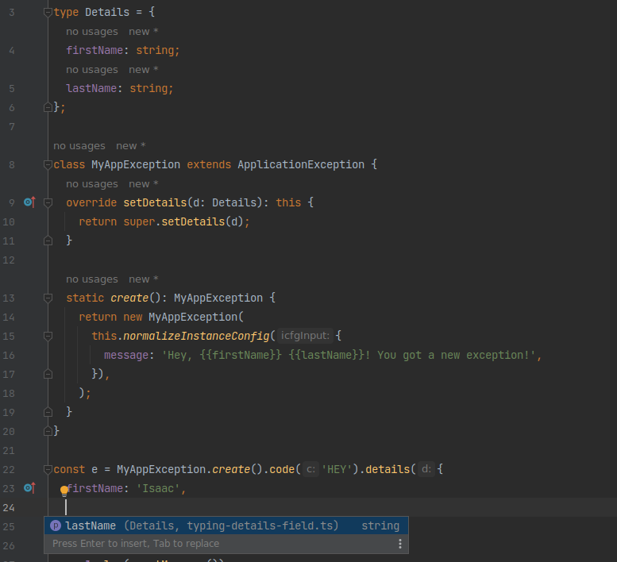
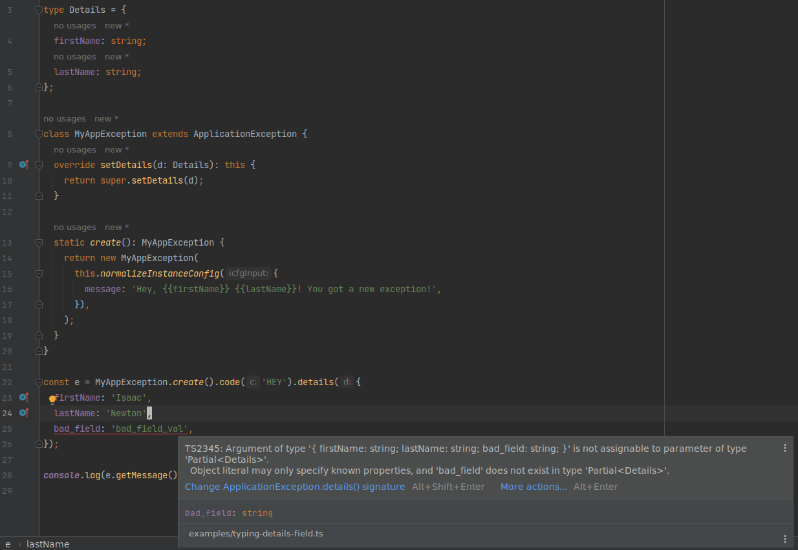

# Application Exception


[](https://www.npmjs.com/package/@tsconfig/strictest)
[](https://www.npmjs.org/package/application-exception)
[](https://www.npmjs.org/package/application-exception)

> **Warning**
> Please use fixed version (remove ^ from package.json).

<!-- TOC -->

- [Features](#features)
- [Motivation](#motivation)
- [Guide](#guide)
  - [Defaults](#defaults)
  - [Fields](#fields)
  - [Constructor variants](#constructor-variants)
  - [Templating](#templating)
  - [Custom exceptions: Extending ApplicationException class](#custom-exceptions-extending-applicationexception-class)
  - [Custom exceptions: Using `subclass` static method](#custom-exceptions-using-subclass-static-method)
  - [Custom exceptions: Providing custom handlebars helpers](#custom-exceptions-providing-custom-handlebars-helpers)
  - [Custom exceptions: Setting a type for `details` field](#custom-exceptions-setting-a-type-for-details-field)

<!-- TOC -->

## Features

- Provides a selection of fields commonly used with exceptions
- Builder pattern for better DX
- Provides a JSON representation available with `toJSON` method (including nested exceptions set with `.causedBy`)
- Error message templating with handlebars
- Configurable with good defaults
- Ergonomically create custom exceptions

## Motivation

> _"Programs that use exceptions as part of their normal processing suffer from all the readability and
> maintainability problems of classic spaghetti code."_
> — Andy Hunt, Dave Thomas - The Pragmatic Programmer

It is hard to disagree with software engineering classics. Nevertheless, many times I found myself reimplementing the
same pattern where
thrown exceptions signify diversion from happy path and carry more information than `message` and `stack` found on
the `Error` class.

I think there is nothing wrong with implementing this each time for every new project, because
different projects are going to have different exceptions. And the citation above hints that I find it preferable to
handle as many exceptions as possible with normal control flow.

The use case for this library that I have in mind is an application back-end which is a thin layer over one or more data
sources (e.g. databases or third-party APIs) and when you throw exceptions expecting a front-end to handle them. It is
likely that in case of working on a project like this you also win more from delivering quickly then you win from
writing exceptional (pun intended) quality code.

I'll be happy if this library is useful for somebody except myself, but please make sure that you really need it.

## Guide

### Defaults

By default `ApplicationException` sets `id`, `timestamp` and `message` fields.

<sub>(Run
with `npm run ts-file ./examples/default-fields-example.ts` or see
example's [source code](./examples/default-fields-example.ts))</sub>

```typescript
const e = AppEx.new();

console.log('id:'.padEnd(10), e.getId());
console.log('timestamp:'.padEnd(10), e.getTimestamp());
console.log('message:'.padEnd(10), e.getMessage());
```

prints

```text
Id:        AE_00Q6F4K3K7FPYQNEFJA1GV465Z
Timestamp: 2023-01-08T02:45:12.309Z
Message:   Something went wrong
```

You can provide a custom message to `ApplicationException.new`.

<sub>(Run
with `npm run ts-file ./examples/default-fields-with-custom-message-example.ts` or see
example's [source code](./examples/default-fields-with-custom-message-example.ts))</sub>

```typescript
const e = AppEx.new(`I'm an error message`);

console.log('id:'.padEnd(10), e.getId());
console.log('timestamp:'.padEnd(10), e.getTimestamp());
console.log('message:'.padEnd(10), e.getMessage());
```

prints

```text
id:        AE_BT006J8JET62NVQM16Z890ENPR
timestamp: 2023-01-08T02:51:02.597Z
message:   I'm an error message
```

### Fields

All fields are listed in `AppExOwnProps` type.<br>

You can use builder methods to set all of these fields except for `message` field because once message is set on `Error`
instance it is impossible to change it.

Here is a simple example.

<sub>(Run with `npm run ts-file ./examples/builder-pattern-simple-example.ts` or see
example's [source code](./examples/builder-pattern-simple-example.ts))</sub>

```typescript
throw AppEx.new(`Could not fetch a resource with id ${id}`)
  .numCode(404)
  .code('RESOURCE_NOT_FOUND')
  .details({ id });
```

This is a more complicated example.

<sub>(Run
with `npm run ts-file ./examples/builder-pattern-example.ts` or see
example's [source code](./examples/builder-pattern-example.ts))</sub>

```typescript
function addUser(email: string): void {
  try {
    storeUser(email);
  } catch (caught) {
    if (caught instanceof Error && caught.message === 'User already exists') {
      throw AppEx.new(`User with this email already exists - ${email}`)
        .displayMessage(
          'We already have a user with this email in the system, maybe you signed up earlier?',
        )
        .code('USER_ALREADY_EXISTS')
        .numCode(400)
        .causedBy(caught)
        .details({ email });
    } else {
      throw AppEx.new('Could not create user')
        .displayMessage('Something went wrong, please visit help center')
        .numCode(500)
        .causedBy(caught)
        .details({ email });
    }
  }
}
```

### Constructor variants

`ApplicationException.new` is the simplest constructor variant.

Other constructors available by default are `lines` and `prefixedLines` (or `plines`).

<sub>(Run
with `npm run ts-file ./examples/constructor-variants-example.ts` or see
example's [source code](./examples/constructor-variants-example.ts))</sub>

```typescript
const e1 = AppEx.lines(
  'Could not fetch user from ThirdParty',
  `- HTTP: GET https://example.org/api/v1`,
  `- Request headers: ${JSON.stringify(req.headers)}`,
  `- Response status: ${JSON.stringify(res.status)}`,
  `- Response headers: ${JSON.stringify(res.headers)}`,
);

const e2 = AppEx.prefixedLines(
  'UserService.getUser',
  'Could not fetch user from ThirdParty',
  ['- HTTP'.padEnd(20), 'GET https://example.org/api/v1'].join(' - '),
  ['- Request headers'.padEnd(20), JSON.stringify(req.headers)].join(' - '),
  ['- Response status'.padEnd(20), JSON.stringify(res.status)].join(' - '),
  ['- Response headers'.padEnd(20), JSON.stringify(res.headers)].join(' - '),
);
```

### Templating

Fields `message` and `displayMessage` are actually [Handlebars](https://handlebarsjs.com/) templates.

<sub>(Run
with `npm run ts-file ./examples/simple-templating-example.ts` or see
example's [source code](./examples/simple-templating-example.ts))</sub>

```typescript
const e = AppEx.new('Bad thing happened').displayMessage(
  'Something went wrong, please contact tech support and provide this id - {{self.id}}',
);

console.log(e.getDisplayMessage());
```

prints

```text
Something went wrong, please contact tech support and provide this id - AE_0DFG6FGFRCY2THPMMCNXAZF4KF
```

You can use fields specified in `details` on the top level. Use `self` to access exception object in handlebars
template. `self` contains all fields available through builder methods on it's top level, like `id` or `code`.
Also, there is a `json` helper function present in compilation context.

All compilation context available is presented in the following example.

<sub>(Run
with `npm run ts-file ./examples/all-templating-helpers-example.ts` or see
example's [source code](./examples/all-templating-helpers-example.ts))</sub>

```typescript
const e = AppEx.new('Bad thing happened')
  .details({
    a: 12345,
    b: 'b-field',
  })
  .displayMessageLines(
    'top level fields',
    '- a - {{a}}',
    '- b - {{b}}',
    'self',
    '- self.id - {{self.id}}',
    '- self.timestamp - {{self.timestamp}}',
    '- self.code - {{self.code}}',
    '- self.numCode - {{self.numCode}}',
    '- self.constructor_name - {{self.constructor_name}}',
    'helpers',
    '- self.id padded 1 - {{pad 40 self.id}}: "I am padded"',
    '- self.id padded 2 - {{pad 40 "-" self.id}}: "I am padded"',
    '- self.details - {{{json self.details}}}',
    '- self.details indented -',
    '{{{json self.details 4}}}',
  );
```

### Custom exceptions: Extending ApplicationException class

Overriding static method `defaults` allows to specify default values of exception fields.

<sub>(Run with `npm run ts-file ./examples/extending-class-example.ts` or see
example's [source code](./examples/extending-class-example.ts))</sub>

```typescript
class MyAppException extends ApplicationException {
  static override defaults(): ApplicationExceptionDefaultsProps {
    return {
      details({ now }) {
        return {
          value: {
            src: 'my-app-api-server',
            ts_in_ukraine: format(now, 'd MMMM yyyy, HH:mm:ss', {
              locale: localeUkraine,
            }),
          },
        };
      },
      useClassNameAsCode() {
        return { value: true };
      },
    };
  }

  static create(this: ApplicationExceptionStatic, num: number) {
    return this.new(
      'Creating from `create` static method. "num" is: {{num}}. Also "src" is set by default: {{src}}.',
    ).details({ num });
  }
}
```

You can still use `new` static method as a constructor like this

```typescript
const e1 = MyAppException.new(
  'Using the default `new` constructor. "src" is set by default: {{src}}',
);
const e1Json = e1.toJSON();
delete e1Json.stack;
console.log(e1Json);
```

which prints

```text
{
  constructor_name: 'MyAppException',
  message: 'Using the default `new` constructor. "src" is set by default: my-app-api-server',
  code: 'MyAppException',
  details: {
    src: 'my-app-api-server',
    ts_in_ukraine: '15 січня 2023, 05:04:46'
  },
  id: 'AE_TDHCSXDTETRSQFTSTS3QRF3SCQ',
  timestamp: '2023-01-15T03:04:46.173Z',
  raw_message: 'Using the default `new` constructor. "src" is set by default: {{src}}',
  v: 'appex/v0.1'
}
```

But you've also defined a `create` static constructor, that should be more suitable to intended calling context
of `MyAppException`.

```typescript
const e2 = MyAppException.create(21);
const e2Json = e2.toJSON();
delete e2Json.stack;
console.log(e2Json);
```

prints

```text
{
  constructor_name: 'MyAppException',
  message: 'Creating from `create` static method. "num" is: 21. Also "src" is set by default: my-app-api-server.',
  code: 'MyAppException',
  details: {
    src: 'my-app-api-server',
    ts_in_ukraine: '15 січня 2023, 05:06:35',
    num: 21
  },
  id: 'AE_3RKF2423NK98JCH82Z25BDWBKR',
  timestamp: '2023-01-15T03:06:35.681Z',
  raw_message: 'Creating from `create` static method. "num" is: {{num}}. Also "src" is set by default: {{src}}.',
  v: 'appex/v0.1'
}
```

You can further extend `MyAppException`. `MyServiceException` inherits all instance and static methods and also inherits
defaults. `details` field objects are merged (can be configured with `mergeDetails` option).

```typescript
class MyServiceException extends MyAppException {
  static override defaults(): ApplicationExceptionDefaultsProps {
    return {
      details() {
        return { value: { scope: 'my-service' } };
      },
    };
  }
}

const e3 = MyServiceException.create(123);
const e3Json = e3.toJSON();
delete e3Json.stack;
console.log(e3Json);
```

prints

```text
{
  constructor_name: 'MyServiceException',
  message: 'Creating from `create` static method. "num" is: 123. Also "src" is set by default: my-app-api-server.',
  code: 'MyServiceException',
  details: {
    src: 'my-app-api-server',
    ts_in_ukraine: '15 січня 2023, 05:07:41',
    scope: 'my-service',
    num: 123
  },
  id: 'AE_V535S4SK0W8RWARKR8DMVBJ5X1',
  timestamp: '2023-01-15T03:07:41.837Z',
  raw_message: 'Creating from `create` static method. "num" is: {{num}}. Also "src" is set by default: {{src}}.',
  v: 'appex/v0.1'
}
```

### Custom exceptions: Using `subclass` static method

`MyAppException` is the same as in example from previous section. Using `subclass` is supposed to be an idiomatic way to
extend `ApplicationException`, but it is less obvious and does not allow you to use new class as TypeScript type. If
this does not prove to be useful, I intend to delete this as a breaking change.

<sub>(Run
with `npm run ts-file ./examples/subclass-example.ts` or see
example's [source code](./examples/subclass-example.ts))</sub>

```typescript
const MyAppException = AppEx.subclass(
  'MyAppException',
  {
    details({ now }) {
      return {
        value: {
          src: 'my-app-api-server',
          ts_in_ukraine: format(now, 'd MMMM yyyy, HH:mm:ss', {
            locale: localeUkraine,
          }),
        },
      };
    },
    useClassNameAsCode() {
      return { value: true };
    },
  },
  function create(this: ApplicationExceptionStatic, num: number) {
    return this.new(
      'Creating from `create` static method. "num" is: {{num}}. Also "src" is set by default: {{src}}.',
    ).details({ num });
  },
);
```

### Custom exceptions: Providing custom handlebars helpers

<sub>(Run
with `npm run ts-file ./examples/custom-handlebars-helpers.ts` or see
example's [source code](./examples/custom-handlebars-helpers.ts))</sub>

```typescript
const MyAppException = AppEx.subclass(
  'MyAppException',
  {
    handlebarsHelpers() {
      return {
        value: {
          'date-iso': function (...args: unknown[]): string {
            return new Date(args[0] as Date).toISOString();
          },
          'date-fmt': function (...args: unknown[]): string {
            return format(new Date(args[1] as Date), args[0] as string, {
              locale: localeUkraine,
            });
          },
        },
      };
    },
    details({ now }) {
      return {
        value: {
          src: 'my-app-api-server',
          ts_in_ukraine: format(now, 'd MMMM yyyy, HH:mm:ss', {
            locale: localeUkraine,
          }),
        },
      };
    },
    useClassNameAsCode() {
      return { value: true };
    },
  },
  function create(this: ApplicationExceptionStatic, num: number) {
    return this.new(
      '{{pad 20 self.constructor_name}} // ISO Date: {{date-iso self.timestamp}}; Formatted Date: {{date-fmt "d MMMM yyyy, HH:mm:ss" self.timestamp}}; num: {{num}}',
    ).details({ num });
  },
);

const e = MyAppException.create(543231);

console.log(e.getMessage());

const MyServiceException = MyAppException.subclass('MyServiceException', {
  details() {
    return { value: { service: 'my-service' } };
  },
});

const e1 = MyServiceException.create(3098);

console.log(e1.getMessage());
```

prints

```text
MyAppException       // ISO Date: 2023-01-15T03:23:00.647Z; Formatted Date: 15 січня 2023, 05:23:00; num: 543231
MyServiceException   // ISO Date: 2023-01-15T03:23:00.660Z; Formatted Date: 15 січня 2023, 05:23:00; num: 3098
```

### Custom exceptions: Setting a type for `details` field

To assign a type to `details` field, you need to override `setDetails` method and make a function with assertion that it
will return a subclass.

<sub>(Run
with `npm run ts-file ./examples/typing-details-fiels.ts` or see
example's [source code](./examples/typing-details-fiels.ts))</sub>

```typescript
type Details = {
  firstName: string;
  lastName: string;
};

class MyAppException extends ApplicationException {
  override setDetails(d: Details): this {
    return super.setDetails(d);
  }

  static create(): MyAppException {
    return new MyAppException(
      this.normalizeInstanceConfig({
        message: 'Hey, {{firstName}} {{lastName}}! You got a new exception!',
      }),
    );
  }
}

const e = MyAppException.create().code('HEY').details({
  firstName: 'Isaac',
  lastName: 'Newton',
});

console.log(e.getMessage());
```

This allows for code completion.



And highlighting not allowed fields by TypeScript aware IDEs.


